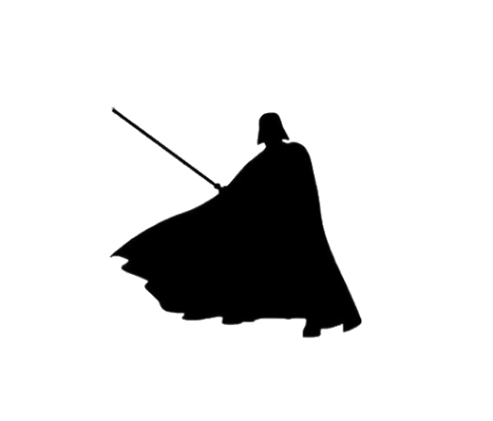
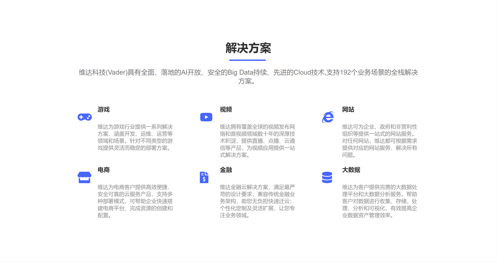
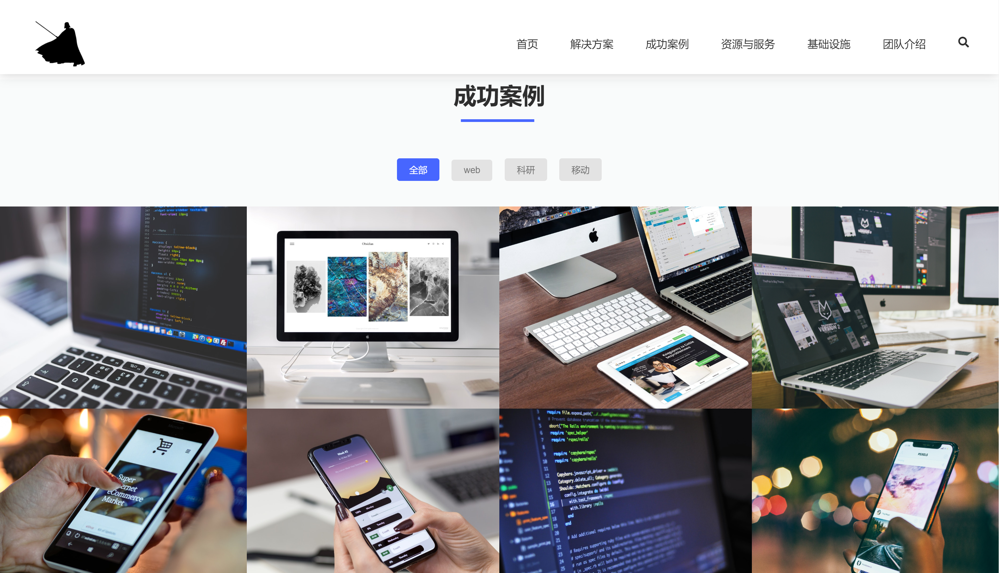
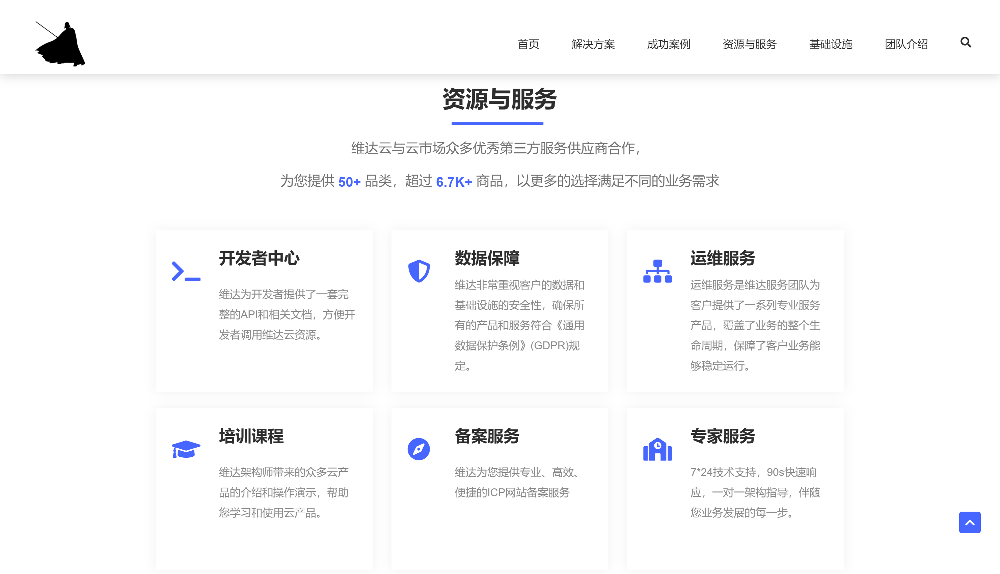
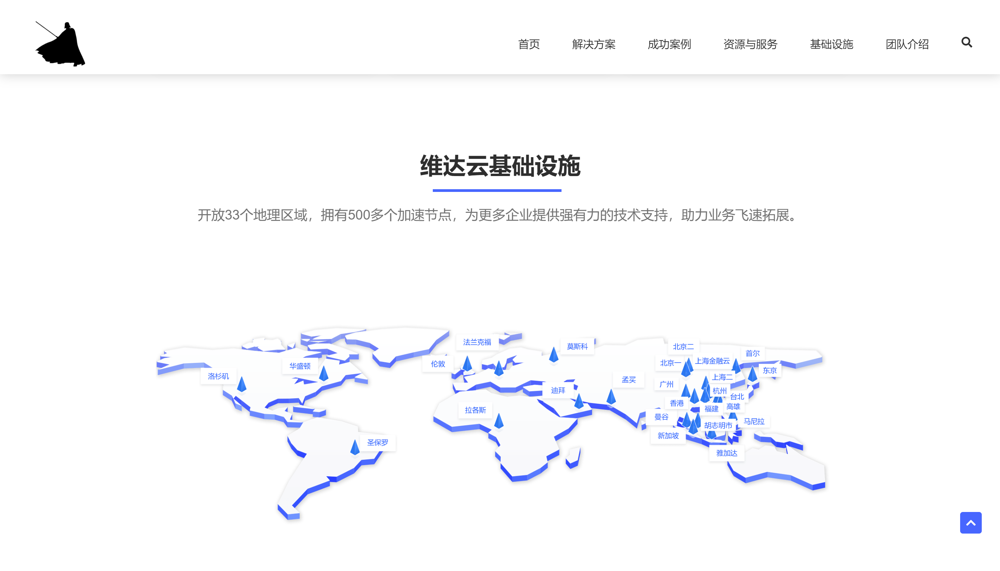
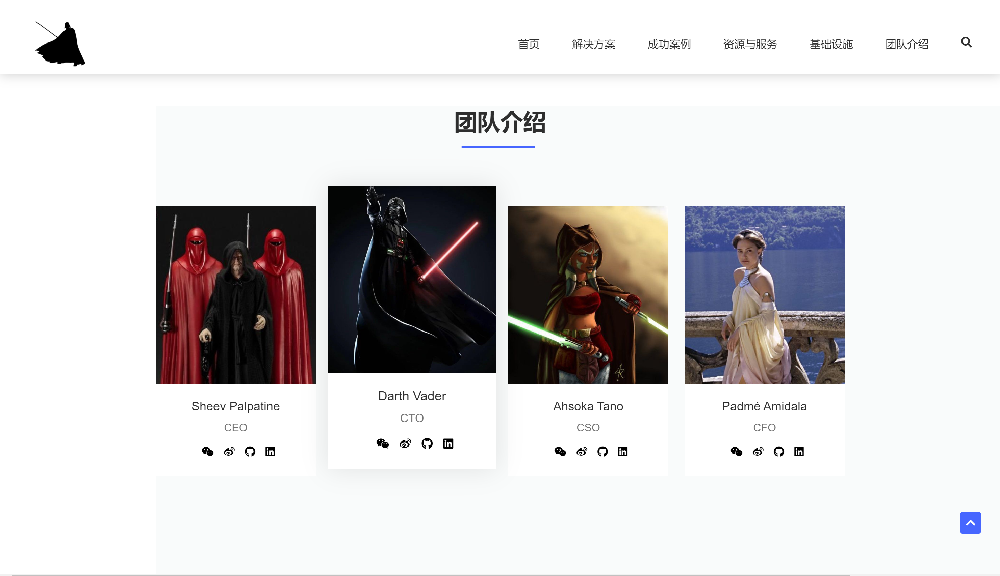
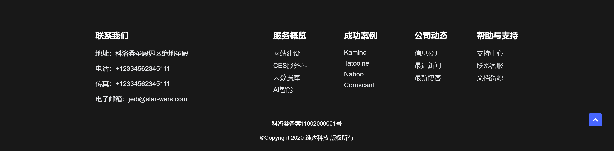

    
    

      

预览地址：

## 🌌Vader

这是维达科技(Vader)的企业官网，维达科技是一家位于科洛桑(Coruscant)的云计算公司，维达的服务由基础服务、平台服务以及应用市场三部分组成。基础服务和平台服务共有12个大类、500余项云服务产品。基础服务涵盖计算、存储、网络、安全和监控5个大类，平台服务包括数据库、大数据、开发测试、人工智能、物联网、视频等类型的服务。维达目前可提供包括混合云、企业上云、高性能计算、专属云等在内的通用解决方案、行业解决方案、安全解决方案及DevOps解决方案。我们的业务覆盖整个银河系，我们是当之无愧的银河帝国第一云计算机公司！

## 🐱‍💻官网开发简介

整个网站分为导航，轮播，解决方案，成功案例，资源与服务，基础设施，数据部分，团队介绍，底部信息等内容区块。

网站整体采用CSS Grid布局，支持响应式，有流畅过渡和展现动画

以下是网站截图：

### 🪐 本项目用到的库
- lsotope.js 成功案例组件
- anime.js 用js控制HTML
- glide.js 轮播图
- scrollreveal 滑动展示
- smooth scroll 流畅滑动动画

