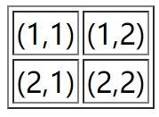
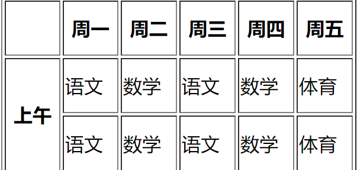
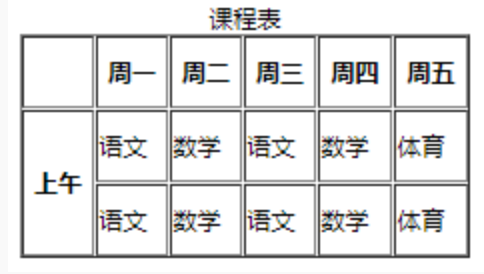

## html基础知识

### 有序列表(ol)
语法格式：
```html
<ol type=value1 start=value2>
    <li></li>
</ol>
```
**注**：value1表示有序列表项目符号的类型，value2表示项目开始的数值

type有以下类型：
type类型 | 描述
---- | ---
1 | 列表项目用数字表示(1,2,3...)
a |  列表项目用小写字母表示(a,b,c...)
A | 列表项目用大写字母表示(A,B,C...)
i | 列表项目用小写罗马字母表示(i,ii,iii...)
I | 列表项目用大写罗马字母表示(I,II,III...)

### 无序列表(ul)
ul的type类型：
- 默认： disc(实心圆)
- 方块：square
- 空心圆：circle

语法格式：
```html
<ul>
    <li>one</li>
    <li>two</li>
</ul>
```
### 自订列表(dl)
自定义列表以`<dl>`标签开始。每个自定义列表项以`<dt>`开始。每个自定义列表项的定义以`<dd>`开始。自定义列表的列表项前没有任何项目符号。

例如：
```html
<dl>
                <dt>春天</dt>
                <dd>万物复苏 </dd>
                <dd>百花争艳 </dd>
                <dd>适合学习</dd>
                <dt>夏天</dt>
                <dd>夏日绵绵</dd>
                <dd>烈日炎炎</dd>
                <dd>适合学习</dd>
            </dl>

```
运行效果：
```
春天
    万物复苏
    百花争艳
    适合学习
夏天
    夏日绵绵
    烈日炎炎
    适合学习
```
### <meta>
<meta>标签提供关于 HTML 文档的元数据：描述（description）、关键词（keywords）、文档的作者（author）等其他元数据。

例如：
```html
<!DOCTYPE HTML>
<html>
<head>
    <meta name="author" content="www.shiyanlou.com"/>
    <meta name="description"  content="A simple example"/>
</head>
<body>
    <a href="https://www.baidu.com">百度</a>
</body>
</html>
```
### 块级元素
- 总是独占一行，表现为另起一行开始，而且其后的元素也必须另起一行显示。宽度(width)、高度(height)、内边距(padding)和外边距(margin)都可控制。
- 常见块级元素： `<h1>`,`<p>`, `<ul>`, `<table>`。

### 内联元素
- 内联元素在显示时通常不会以新行开始。宽度(width)、高度(height)、内边距的 top/bottom(padding-top/padding-bottom)和外边距的 top/bottom(margin-top/margin-bottom)都不可改变。

- 常见内联元素：`<b>`, `<td>`, `<a>`, ``。

### html的表格
表格在网页中主要有两种用途：存放数据和组织网页内容。
#### 表格的基础知识
`<table>...</table>`用于创建表格。
`<tr>`用于定义每一行。
`<td>`用于定义每一列。

例如：
```html
<table>
    <tr>
        <td>(1,1)</td>
        <td>(1,2)</td>
    </tr>
    <tr>
        <td>(2,1)</td>
        <td>(2,2)</td>
    </tr>
</table>

```
显示效果为：
```
(1,1)	(1,2)
(2,1)	(2,2)
```
可以给表格添加边框：
```html
<table border="1"></table>
```
如下：



**注**：border="1"指表格边框厚度为1px，默认值为0.

表格的其他常用属性如下，使用方法与border一样：

属性名 | 含义 | 常用属性值
---- | --- | --- |
cellspacing | 设置单元格之间的距离 | 单位为px，默认为2px
cellpadding | 设置文字与单元格之间距离 | 默认1px
width | 设置表格宽度 | 单位为px
height | 设置表格高度 | 单位为px
bgcolor | 设置背景颜色 | red，green
#### 使用`<th></th>`添加表头
表头一般位于表格的第一行或第一列，其文本加粗居中显示，就类似于课程表上的第一行日期的显示，而表头的设置也很简单，只需要用`<th></th>`代替`<td></td>`即可。
#### 按行/列合并单元格
可以用`colspan`(合并行)和`rowspan`(合并列)合并单元格

例如：
```html
<table border="1" width="300px" height="150px">
    <tr>
        <th></th>
        <th>周一</th>
        <th>周二</th>    
        <th>周三</th>
        <th>周四</th>    
        <th>周五</th>
    </tr>
    <tr>
        <th rowspan="2">上午</th>
        <td>语文</td>
        <td>数学</td>    
        <td>语文</td>
        <td>数学</td>    
        <td>体育</td>    
    </tr>
    <tr>
        <!--<th></th>-->
        <td>语文</td>
        <td>数学</td>    
        <td>语文</td>
        <td>数学</td>    
        <td>体育</td>    
    </tr>
</table>
```
效果如下：



#### 表格的其他功能
- 表格标题
紧随table标签之后，创建caption标签。这就是表格的标题。通常这个标题会被居中于表格之上。
例如：
```html
<table border="1" width="300px" height="150px">
    <caption>课程表</caption>
    <tr>
        <th></th>
        <th>周一</th>
        <th>周二</th>    
        <th>周三</th>
        <th>周四</th>    
        <th>周五</th>
    </tr>
    <tr>
        <th rowspan="2">上午</th>
        <td>语文</td>
        <td>数学</td>    
        <td>语文</td>
        <td>数学</td>    
        <td>体育</td>    
    </tr>
    <tr>
        <!--<th></th>-->
        <td>语文</td>
        <td>数学</td>    
        <td>语文</td>
        <td>数学</td>    
        <td>体育</td>    
    </tr>
</table>
```
浏览器中显示的效果为：

- table元素布局
现在很多布局都是使用div+css形式。table布局中：

1.`<thead></thead>`：用于定义表格的头部，一般包含网页的logo和导航等头部信息,位于`<table></table>`之中。

2.`<tfoot></tfoot>`：用于定义表格的页脚，一般包含网页底部的企业信息，地址联系方式等，位于`<table></table>`标记之中，`<thead></thead>`标记之后。

3.`<tbody></tbody>`：用于定义表格的主体，一般包含网页中除头部和底部之外的其他内容，位于`<table></table>`标记之中，`<tfoot></tfoot>`标记之后。

下面是一个表格的例子：
