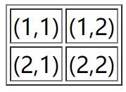
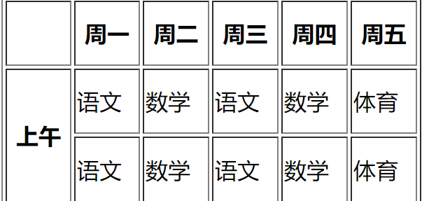
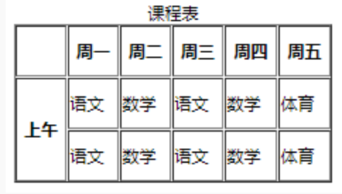
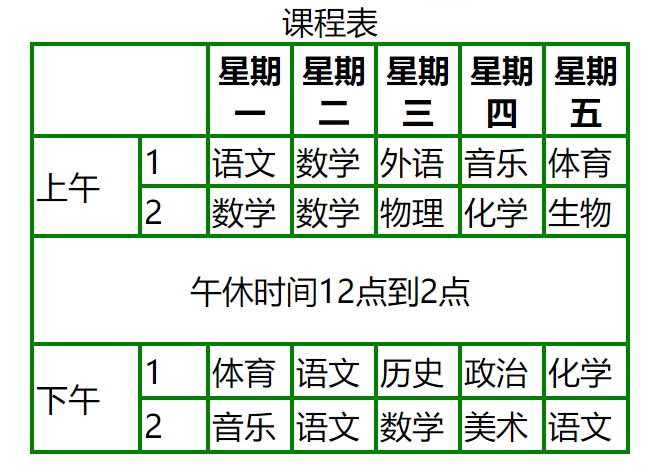
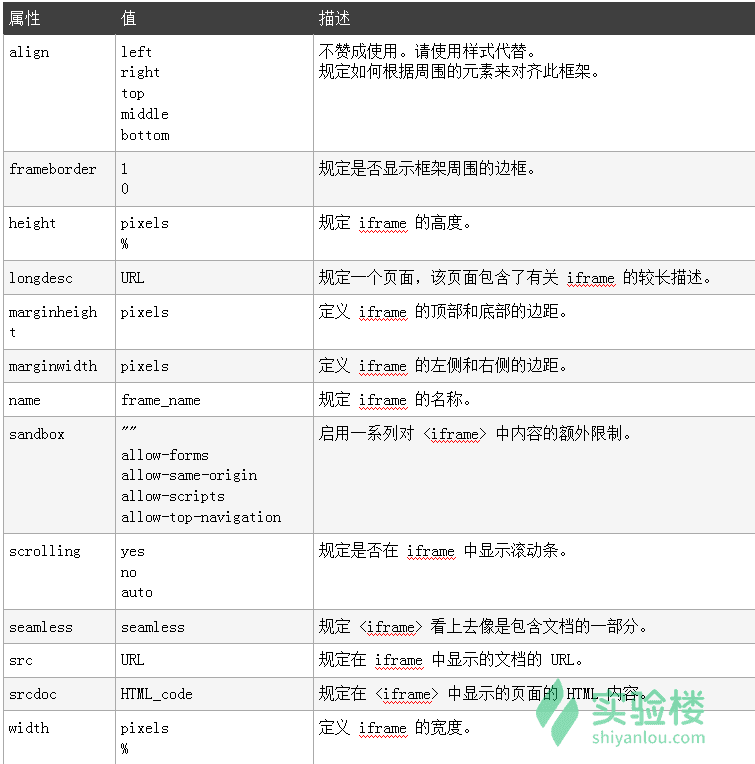
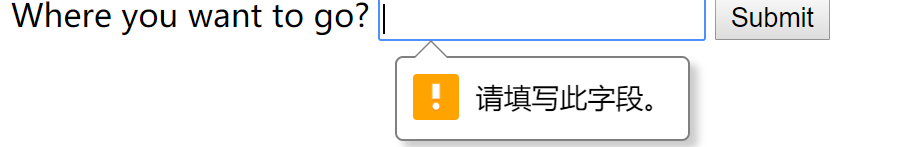
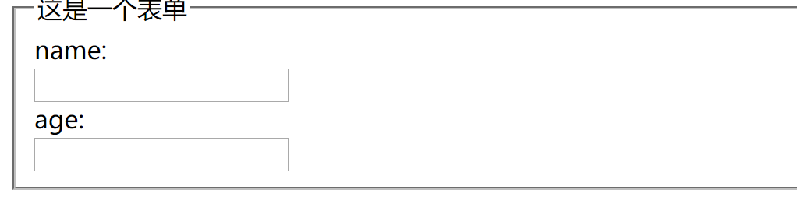

## html基础知识

### 有序列表(ol)
语法格式：
```html
<ol type=value1 start=value2>
    <li></li>
</ol>
```
**注**：value1表示有序列表项目符号的类型，value2表示项目开始的数值

type有以下类型：
type类型 | 描述
---- | ---
1 | 列表项目用数字表示(1,2,3...)
a |  列表项目用小写字母表示(a,b,c...)
A | 列表项目用大写字母表示(A,B,C...)
i | 列表项目用小写罗马字母表示(i,ii,iii...)
I | 列表项目用大写罗马字母表示(I,II,III...)

### 无序列表(ul)
ul的type类型：
- 默认： disc(实心圆)
- 方块：square
- 空心圆：circle

语法格式：
```html
<ul>
    <li>one</li>
    <li>two</li>
</ul>
```
### 自订列表(dl)
自定义列表以`<dl>`标签开始。每个自定义列表项以`<dt>`开始。每个自定义列表项的定义以`<dd>`开始。自定义列表的列表项前没有任何项目符号。

例如：
```html
<dl>
                <dt>春天</dt>
                <dd>万物复苏 </dd>
                <dd>百花争艳 </dd>
                <dd>适合学习</dd>
                <dt>夏天</dt>
                <dd>夏日绵绵</dd>
                <dd>烈日炎炎</dd>
                <dd>适合学习</dd>
            </dl>

```
运行效果：
```
春天
    万物复苏
    百花争艳
    适合学习
夏天
    夏日绵绵
    烈日炎炎
    适合学习
```
### <meta>
<meta>标签提供关于 HTML 文档的元数据：描述（description）、关键词（keywords）、文档的作者（author）等其他元数据。

例如：
```html
<!DOCTYPE HTML>
<html>
<head>
    <meta name="author" content="www.shiyanlou.com"/>
    <meta name="description"  content="A simple example"/>
</head>
<body>
    <a href="https://www.baidu.com">百度</a>
</body>
</html>
```
### 块级元素
- 总是独占一行，表现为另起一行开始，而且其后的元素也必须另起一行显示。宽度(width)、高度(height)、内边距(padding)和外边距(margin)都可控制。
- 常见块级元素： `<h1>`,`<p>`, `<ul>`, `<table>`。

### 内联元素
- 内联元素在显示时通常不会以新行开始。宽度(width)、高度(height)、内边距的 top/bottom(padding-top/padding-bottom)和外边距的 top/bottom(margin-top/margin-bottom)都不可改变。

- 常见内联元素：`<b>`, `<td>`, `<a>`, ``。

### html的表格
表格在网页中主要有两种用途：存放数据和组织网页内容。
#### 表格的基础知识
`<table>...</table>`用于创建表格。
`<tr>`用于定义每一行。
`<td>`用于定义每一列。

例如：
```html
<table>
    <tr>
        <td>(1,1)</td>
        <td>(1,2)</td>
    </tr>
    <tr>
        <td>(2,1)</td>
        <td>(2,2)</td>
    </tr>
</table>

```
显示效果为：
```
(1,1)	(1,2)
(2,1)	(2,2)
```
可以给表格添加边框：
```html
<table border="1"></table>
```
如下：



**注**：border="1"指表格边框厚度为1px，默认值为0.

表格的其他常用属性如下，使用方法与border一样：

属性名 | 含义 | 常用属性值
---- | --- | --- |
cellspacing | 设置单元格之间的距离 | 单位为px，默认为2px
cellpadding | 设置文字与单元格之间距离 | 默认1px
width | 设置表格宽度 | 单位为px
height | 设置表格高度 | 单位为px
bgcolor | 设置背景颜色 | red，green
#### 使用`<th></th>`添加表头
表头一般位于表格的第一行或第一列，其文本加粗居中显示，就类似于课程表上的第一行日期的显示，而表头的设置也很简单，只需要用`<th></th>`代替`<td></td>`即可。
#### 按行/列合并单元格
可以用`colspan`(合并行)和`rowspan`(合并列)合并单元格

例如：
```html
<table border="1" width="300px" height="150px">
    <tr>
        <th></th>
        <th>周一</th>
        <th>周二</th>    
        <th>周三</th>
        <th>周四</th>    
        <th>周五</th>
    </tr>
    <tr>
        <th rowspan="2">上午</th>
        <td>语文</td>
        <td>数学</td>    
        <td>语文</td>
        <td>数学</td>    
        <td>体育</td>    
    </tr>
    <tr>
        <!--<th></th>-->
        <td>语文</td>
        <td>数学</td>    
        <td>语文</td>
        <td>数学</td>    
        <td>体育</td>    
    </tr>
</table>
```
效果如下：



#### 表格的其他功能
- 表格标题
紧随table标签之后，创建caption标签。这就是表格的标题。通常这个标题会被居中于表格之上。
例如：
```html
<table border="1" width="300px" height="150px">
    <caption>课程表</caption>
    <tr>
        <th></th>
        <th>周一</th>
        <th>周二</th>    
        <th>周三</th>
        <th>周四</th>    
        <th>周五</th>
    </tr>
    <tr>
        <th rowspan="2">上午</th>
        <td>语文</td>
        <td>数学</td>    
        <td>语文</td>
        <td>数学</td>    
        <td>体育</td>    
    </tr>
    <tr>
        <!--<th></th>-->
        <td>语文</td>
        <td>数学</td>    
        <td>语文</td>
        <td>数学</td>    
        <td>体育</td>    
    </tr>
</table>
```
浏览器中显示的效果为：

- table元素布局
现在很多布局都是使用div+css形式。table布局中：

1.`<thead></thead>`：用于定义表格的头部，一般包含网页的logo和导航等头部信息,位于`<table></table>`之中。

2.`<tfoot></tfoot>`：用于定义表格的页脚，一般包含网页底部的企业信息，地址联系方式等，位于`<table></table>`标记之中，`<thead></thead>`标记之后。

3.`<tbody></tbody>`：用于定义表格的主体，一般包含网页中除头部和底部之外的其他内容，位于`<table></table>`标记之中，`<tfoot></tfoot>`标记之后。

下面是一个表格的例子：

```html

<!DOCTYPE html>
<html lang="en">
<head>
    <meta charset="UTF-8">
    <title>Document</title>
</head>
<body>
    <!-- 1.先确定表格的大小，背景色等属性 
        2.先画图，根据图片将表格按行分解，从每一行开始写
        3.第一行，就一列，是星期，作为表头(其实每一行中的某个元素都能用表头标签，结果就是字体加粗了)
        4.上午两行，将第一列的两行合并，加宽
        5.中午行宽为7，和整个行宽一致
        -->
    <table width="300" height="200" bgcolor="green"  align="center" >
    <caption>课程表</caption>
    <!-- 第一行，课程表的星期 -->
        <tr bgcolor="white">
            <!-- 前两个表格没有用，就合并了 -->
            <th width="80" colspan="2"></th>
            <th>星期一</th>
            <th>星期二</th>
            <th>星期三</th>
            <th>星期四</th>
            <th>星期五</th>
        </tr>
        <!-- 上午那一列 -->
        <tr bgcolor="white">
            <!-- 第一二列合并 -->
            <td rowspan="2" width="50">上午</td>
            <td width="30">1</td>
            <td>语文</td>
            <td>数学</td>
            <td>外语</td>
            <td>音乐</td>
            <td>体育</td>
        </tr>
        <tr bgcolor="white">
            <!-- <td></td> -->
            <td>2</td>
            <td>数学</td>
            <td>数学</td>
            <td>物理</td>
            <td>化学</td>
            <td>生物</td>
        </tr>
        <!-- 中午休息那一行 -->
        <tr bgcolor="white" align="center">
            <td colspan="7" height="50">午休时间12点到2点</td>
            
           
        </tr>
        <tr bgcolor="white">
            <td rowspan="2" height="50">下午</td>
            <td>1</td>
            <td>体育</td>
            <td>语文</td>
            <td>历史</td>
            <td>政治</td>
            <td>化学</td>
        </tr>
        <tr bgcolor="white">
            <!-- <td></td> -->
            <td>2</td>
            <td>音乐</td>
            <td>语文</td>
            <td>数学</td>
            <td>美术</td>
            <td>语文</td>
        </tr>
    </table>
</body>
</html>
```
### html多媒体
#### html图片
图片的标签``

有的时候需要让图片根据父元素自适应变化大小，使得网页更加美观。这时候需要将width设置为100%，就能使得图片随着窗口宽度改变而自适应变化大小。
#### html video
`<video src=" "</vedio>`
video有以下属性：
- autoplay：如果出现该属性，视频在就绪后马上播放
- controls：如果出现，向用户展示控件，比如播放按钮
- height：设置视频播放器的高度
- weight：设置视频播放器的宽度
- loop：如果出现，循环播放视频
- preload：如果出现，视频在页面加载的时候就进行加载，如果已经有了autoplay，就不用管这个属性了
- src：要播放的url

#### html音频
`<audio controls><source src="" type="audio/mp3"></audio>`

#### iframe
iframe元素会创建包含另外一个文档的内联框架，用于嵌入其他网页

语法格式如下：
`<iframe src="" width=" " height=" " frameborder="1/0 name="" scrolling="yes/no/auto"></iframe>`

常用属性如下：


### html表单
表单负责数据的采集，一般情况下，表单由三部分构成：
- 表单标签：包含了处理表单数据所用程序的url以及数据提交到服务器的方法
- 表单域：包含了文本框，密码框，隐藏域，多行文本框，复选框，单选框等
- 表单按钮：包含提交按钮，复位按钮和一般按钮。

表单的语法结构为：
`<from name="" method="get/post" action="url" ></from>`

#### action
其中，action是用来指定表单处理程序的位置。action定义了发送数据要去的地址，其值必须是一个有效的url，可以是相对url也可以是绝对url，**如果没有提供此属性或者action="#"，数据将被发送到包含表单页面的url**

#### method
##### get
method属性中，使用get方法后，浏览器会将数据直接附在表单的action url之后，两者之间通过？进行间隔。例如：
```html
<!DOCTYPE html>
<html lang="en">
    <head>
        <meta charset="utf-8">
        <title>form</title>
    </head>
    <body>
        <form action="https://www.shiyanlou.com/" method="GET">
        <div>
            <label for="say">What do you want to say?</label>
            <input name="say" id="say" value="hello">
        </div>

        <div>
            <label for="to">Where do you want to go?</label>
            <input name="to" id="to" value="China">
        </div>

        <div>
            <button>发送数据</button>
        </div>
        </form>
    </body>
</html>

```

可以看到，但点击数据提交按钮时，浏览器就会发生跳转，浏览器地址栏的值会变成：
https://www.shiyanlou.com/?say=hello&to=China

可以更确切地说，数据被附加到url作为一系列的名称/值对。在url结束之后，包括了一个？，后面是值对，每一个都由一个&符号分隔开。
##### post
使用 post 方法。首先，浏览器将与 action 属性中指定的表单处理服务器建立联系，一旦建立连接之后，浏览器就会按分段传输的方法将数据发送给服务器。在服务器端，一旦 post 样式的应用程序开始执行时，就应该从一个标志位置读取参数，而一旦读到参数，在应用程序能够使用这些表单值以前，必须对这些参数进行解码。用户特定的服务器会明确指定应用程序应该如何接受这些参数。
#### 表单验证
##### required属性
输入值不能为空，空了就提示错误。例如：
```html
<form >
            <label for="place">Where you want to go?</label>
            <input id="place" name="
            place" required>
            <button>Submit</button>
        </form>
```
如果输入为空：

##### 强制条目长度
所有的文本框(`<input>`或者`<textarea>`)可以强制使用`minlength`和`maxlength`属性，如果值大于`maxlength`或小于`minlength`就是无效的。
#####表单标题
`<fieldset>`元素组合表单中的相关数据，`<legend>`元素为`<fileset>`元素定义标题。例如：
```html
<form>
            <fieldset>
                <legend>这是一个表单</legend>
                name:<br>
                <input type="text" name="yourname">
                <br>
                age:<br>
                <input type="text" name="yourage">
            </fieldset>
        </form>

```
显示效果为：


##### label元素
label为 input 元素定义标注（标记）,当用户选择该标签时，浏览器就会自动将焦点转到和标签相关的表单控件上。`<label> `标签的 for 属性应当与相关元素的 id 属性相同，使得`<label>` 标签与 `<input>` 正确相关联。